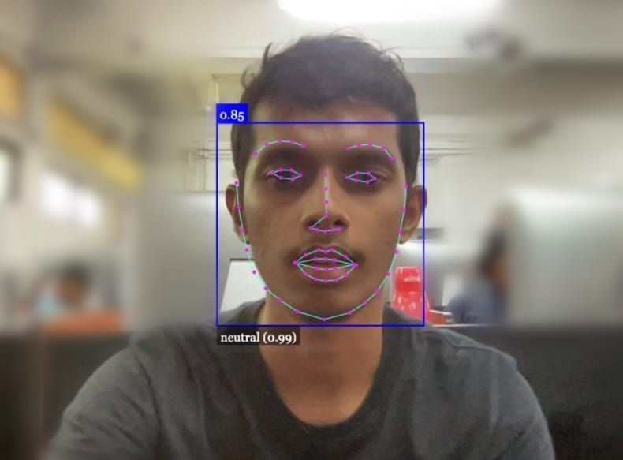
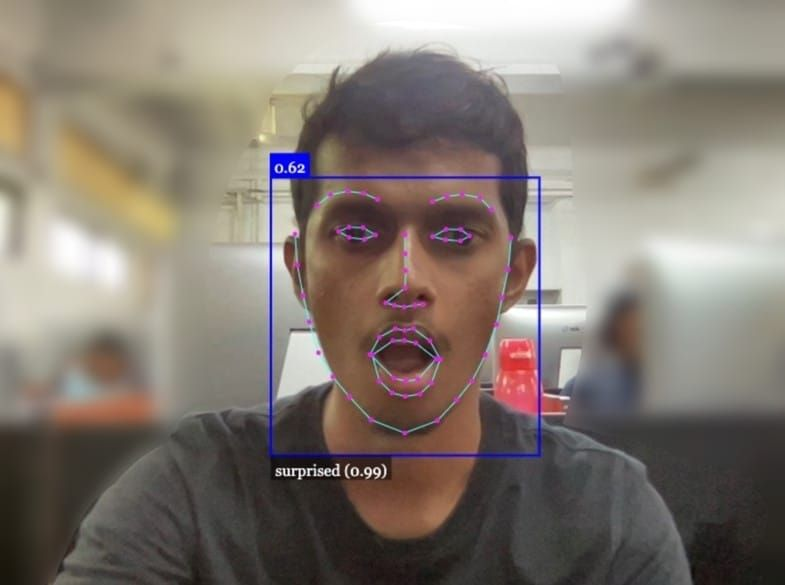

# Face Recognition using AI with face-api.js

This project uses the Face API JS library built on Tensor Flow to enable face recognition for any image. With the use of AI, the system is able to quickly identify the name of every character in an image without much performance overhead.

## Results

## Concepts Covered

- Using Face API to detect faces
- Drawing facial detections on a canvas
- Determining face identity using facial recognition

## Usage

To use this system, simply upload an image to the website and wait for the system to detect and recognize the faces in the image. The system is easily extensible and can recognize any person by simply adding a picture of their face and adding their name to the code.

## Getting Started

To get started with this project, follow these steps:

1. Install the necessary libraries and dependencies by running `npm install`.
You need to run this on a live server otherwise this code won't run in your local device. check the facedetection repo to create a live server from scratch.
2. Load the required models by running `faceapi.nets.faceRecognitionNet.loadFromUri('/models')`, `faceapi.nets.faceLandmark68Net.loadFromUri('/models')`, and `faceapi.nets.ssdMobilenetv1.loadFromUri('/models')`.
3. Create a container for the image and append it to the `document.body`.
4. Load the labeled images by running `loadLabeledImages()`.
5. Create a `FaceMatcher` object using the labeled face descriptors and a matching threshold.
6. Add an event listener to the image upload button to detect and recognize faces in the uploaded image.

## Demo

Check out the [https://facerecognition.epcm18.repl.co/] to see this face recognition system in action.

## Acknowledgments

This project was made possible with the help of the following resources:

- [Face API JS library](https://github.com/justadudewhohacks/face-api.js/)
- [Tensor Flow](https://www.tensorflow.org/)

## Face-Detection

I've also created a real time face detecting system with webcam using face-api. Link to that given below.
-[https://github.com/epcm18/FaceDetection]
